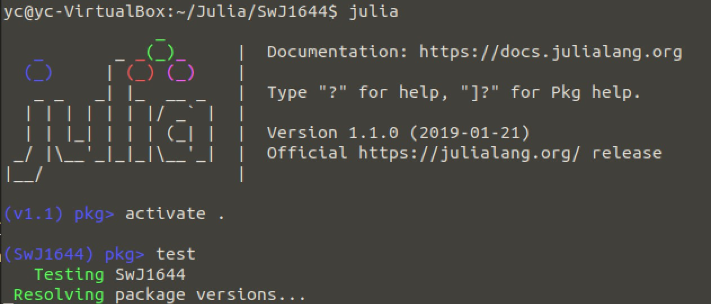

# Julia-notes
Julia学习笔记，起源于： https://github.com/eschnett/2018-computational-physics-course 
随着使用过程逐渐增加内容。

[TOC]

## 基本用法

### 如何用起来
#### 1 最简单的办法 
https://juliabox.com/ 在线的，什么都配置好了，直接去用就是了
#### 2 安装 Julia
在Ubuntu下可以这样 
#### 3 使用 Jupyter+Julia

### 一些参考页面
首先当然是搜索啦。
https://juliadocs.github.io/Julia-Cheat-Sheet/ cheat sheet，可以不时地去看看。

### 运行一个jl脚本
见 “用Julia编程” https://github.com/yuanchuanzou/Julia-notes#%E7%94%A8julia%E7%BC%96%E7%A8%8B

### 进入和退出packge模式
进入"]"
退出 “Backspace”

### 进入、退出shell模式
进入";"
退出 “Backspace”

### Jupyter 可作为一个线上Julia笔记本
类似methamatica的notebook。可以针对各种语言。


## 一些有趣或者有用的包
（以字母为序）
主要来自2018.9.26 Erik的课上介绍
要找这些包很容易，上GitHub搜就是了。使用的话也很容易
    julia> using ForwardDiff
如果没被放到Julia官方的库中，就把网址给上即可，如
    julia> add https://github.com/JuliaApproximation/***.git

Julia各种包的官网在：https://pkg.julialang.org/

### ApproxFun.jl
把任何一个函数变成多项式，这样可以轻松做微积分，求根。当然精度不那么高了。

### BenchmarkTools
https://github.com/JuliaCI/BenchmarkTools.jl

### Calculus 微分积分
https://github.com/JuliaMath/Calculus.jl

### CAS 针对csv文件的读写
https://github.com/JuliaData/CSV.jl

### Cosmology.jl 计算宇宙学距离
https://github.com/JuliaAstro/Cosmology.jl

### DifferentialEquations 数值解微分方程
https://github.com/JuliaDiffEq/DifferentialEquations.jl
这个包看起来很完整了。应该属于Julia的一个重量级的功能。

###  Documenter 自动生成说明文档
https://github.com/JuliaDocs/Documenter.jl

### ForwardDiff.jl 与ReverseDiff 功能类似，对象不同。
貌似是可以暂时不做求导，等到需要的时候根据对象是什么分别求导。

### FunctionalCollections
https://github.com/JuliaCollections/FunctionalCollections.jl

### Gadfly 又一个画图的包，深受ggplot2影响，GitHub上也很活跃。
https://github.com/GiovineItalia/Gadfly.jl

### HDF5 一种数据存储格式
https://github.com/JuliaIO/HDF5.jl
https://github.com/JuliaIO/JLD2.jl
可以用于存储和读写

### IJulia 一个类似于Jupyter的互动的可以网页上显示的Julia终端
https://github.com/JuliaLang/IJulia.jl

### Interact 可视化的一种办法
https://github.com/JuliaGizmos/Interact.jl

### Julia.jl 分门别类地列举了各种科学计算已有的Julia包
https://github.com/svaksha/Julia.jl

### JuMP Modeling language for Mathematical Optimization (linear, mixed-integer, conic, semidefinite, nonlinear)
https://github.com/JuliaOpt/JuMP.jl

### MonteCarloMeasurements.jl
https://github.com/baggepinnen/MonteCarloMeasurements.jl
可以进行任意分布的误差传递
对应的是直接进行误差传递的是Measurements.jl

### NBInclude.jl 将IJulia的文件直接想jl一样运行
这解决了用IJulia写的东西想在Julia命令行下运行的问题。应该只能小应用一下，不能作为开发的主力。
https://github.com/stevengj/NBInclude.jl

### PackageCompiler 把开发的包编译成可执行文件
https://github.com/JuliaLang/PackageCompiler.jl

### Profiling  可以用于调试程序，优化程序
Julia内置的，它可以看那些命令被调用了多少次。
### PyCall 在Julia里调用Python的命令
https://github.com/JuliaPy/PyCall.jl

### Rewrite.jl 重写成更用户友好的表达式，比如归一化，整理等。
https://github.com/HarrisonGrodin/Rewrite.jl

### Unitful 在各种单位制下的物理常数
https://github.com/ajkeller34/Unitful.jl


## 一些有趣或者有用的“社区” 
（以字母为序）
### JuliaData 各种和数据打交道的包
https://github.com/JuliaData/

### JuliaGraphs 跟图相关的（不是用数据画图）
https://github.com/JuliaGraphs

### JuliaPlots 各种跟作图相关的包
https://github.com/JuliaPlots
甚至还有相应的网站 http://docs.juliaplots.org/latest/
但也并不是所有的跟画图相关的都在这里，比如很活跃的gadfly

### JuliaPy 将Python和Julia联系起来的包
https://github.com/JuliaPy

### JuliaStats 用Julia做统计
https://github.com/JuliaStats

## 一些实例

### 新建一个REPL（项目）
1. 进入pkg模式 ]
2. generate aaa 这样就会新建一个目录了，里边有一个hello world的实例文件，修改它
3. 在系统命令行中，或者目录管理器中，当前aaa文件夹下， 新建test文件夹
4. 在test文件夹下新建runtests.jl, 内容为 
using aaa
@show greet()
5. 回到julia的pkg模式， 输入activite . (以后每次都在aaa文件夹下打开Julia)
6. pkg模型输入 test，就自动执行，不过很慢

### 用Julia编程
本来runtests.jl就可以用来编程了，想做什么都在这上面写，但是每次在pkg模式下速度特别慢，它要每次都重新载入各种包的。

正确的做法是 \sout{在工作目录下建一个bbb.jl文件，内容如下：}
julia> include("runtests.jl")
第一次比较慢，之后就不会重复载入，而变得快了。

### 使用RCall调用R中的各种包
以使用R中的ggplot2为例，有了它就不需要别的画图工具了。
1. 安装R，Ubuntu下 sudo apt-get install r-base
2. 在R下安装ggplot2的包
sudo R 进入R，（sudo进入后安装的才是全局可用的包，否则可能会麻烦，比如要人为设置路径啥的，并没有测试）
install.packages()会弹出对话框，让选安装什么；或者直接install.packages("ggplot2")
3. 在Julia下，package模式中, add RCall
注意，以后可能需要新的包，每次在R中新安装了包之后，在Julia要重新做，命令是 build RCall
4. using RCall; 
@rlibrary ggplot2
就可以用了。(目前有个问题是qplot还不能用，ggplot是可以的，用起来麻烦一点儿，但一旦设置好，可重复使用。)

### 一个关于global的问题
在下面这段code中，我必须在for循环中把tp3设成global
```
e2 = e[1:N2-1] #truncate the tails, which was set to be larger
P2 = P[1:N2-1]
tp3 = P2[1]
tp4 = ones(N2-1)
tp4[1] = tp3
for i in 2:N2-1
    global(tp3) = tp3 + P2[i]
    tp4[i] = tp3
end
```
原因是这是主程序中，然后主程序的“tp3 = P2[1]”把它当成了global的，但是在for里边被当成local的。结果就会显示说在“global(tp3) = tp3 + P2[i]”如果变成“tp3 = tp3 + P2[i]”就会显示错误说tp3没有定义。但加个global也太难看了。
解决办法是把这段程序包到一个function里边去。在function里边，就不需要定义global了。

